Universidad de San Carlos de Guatemala  
Facultad de Ingenieria  
Escuela de ciencias y sistemas  
Laboratorio de analisis y diseño 2  
  

|  Carnet | Nombre   |
| ------------ | ------------ |
| Luisa Maria Ortiz Romero  | 202003381   |
| Marjorie Gissell Reyes Franco | 202000560   |
| Luis Manuel Chay Marroquin  | 202000343  |
| Cristian Alessander Blanco Gonzalez  | 202000173  |
| Brayan Alexander Mejia Barrientos  |  201900576   |  

## Índice

1. [Antecedentes](#1-antecedentes)
2. [Core del Negocio](#2-core-del-negocio)
   - [Descripción](#a-descripción)
   - [Diagrama de CDU de Alto Nivel y su Primera Descomposición](#b-diagrama-de-cdu-de-alto-nivel-y-su-primera-descomposición)
3. [Lista de Requerimientos Funcionales Generales](#3-lista-de-requerimientos-funcionales-generales)
4. [Diagrama de CDU Expandidos](#4-diagrama-de-cdu-expandidos)
5. [Matrices de Trazabilidad](#5-matrices-de-trazabilidad)
   - [Stakeholders vs Requerimientos](#a-stakeholders-vs-requerimientos)
   - [Stakeholders vs CDU](#b-stakeholders-vs-cdu)
   - [Requerimiento vs CDU](#c-requerimiento-vs-cdu)
6. [Diagrama de Despliegue de la Arquitectura](#6-diagrama-de-despliegue-de-la-arquitectura)
7. [Selección del o los Estilos Arquitectónicos](#7-selección-del-o-los-estilos-arquitectónicos)
8. [Diagrama de Implementación (Despliegue y Componentes)](#8-diagrama-de-implementación-despliegue-y-componentes)
9. [Diagrama Entidad-Relación](#9-diagrama-entidad-relación)
10. [Prototipos de Interfaces](#10-prototipos-de-interfaces)
11. [Patrones de Diseño](#11-patrones-de-diseño)
12. [Tablero Kanban](#12-tablero-kanban)

## 1. Antecedentes

El proyecto de la aplicación QNave surge a partir de los desafíos que enfrentó una empresa de transporte privado en Guatemala, que inició sus operaciones en el año 2020. Inicialmente, la empresa operaba coordinando viajes mediante llamadas telefónicas entre los usuarios y los conductores. Sin embargo, este modelo operativo pronto encontró obstáculos significativos debido a la pandemia global y al creciente problema de inseguridad en el país.

Uno de los principales desafíos fue el aumento de la delincuencia organizada, que afectaba tanto a conductores como a usuarios. La situación se agravó hasta el punto en que los incidentes de robos, fraudes y amenazas se volvieron comunes, lo que generó una creciente sensación de inseguridad entre los conductores. Como resultado, muchos de ellos optaron por dejar la empresa en busca de empleos más seguros, y los usuarios comenzaron a migrar hacia competidores que ofrecían mayores garantías de seguridad.

Reconociendo la creciente insatisfacción y los riesgos a los que se enfrentaban tanto usuarios como empleados, el CEO de QNave decidió modernizar las operaciones de la empresa. El primer paso hacia este objetivo fue contratar a un programador freelance para desarrollar una solución tecnológica que mejorara la eficiencia y seguridad del servicio. Sin embargo, a pesar de los esfuerzos del programador, la solución propuesta carecía de claridad en su documentación, lo que dejó a la gerencia de la empresa con dudas sobre su viabilidad y escalabilidad a largo plazo.

Debido a estas preocupaciones, la gerencia de QNave decidió buscar una segunda opinión de un equipo profesional (incluyendo a ti y a tu grupo) para obtener una perspectiva más amplia y estratégica. El objetivo es abordar los desafíos actuales, optimizar los costos operativos y posicionar a QNave como líder en el mercado de transporte privado en Guatemala.

Este proyecto tiene como finalidad crear un marco de arquitectura de software robusto que asegure la adaptabilidad del sistema a futuros cambios, con un enfoque en mejorar la seguridad, escalabilidad y sostenibilidad financiera.

## 2. Core del Negocio

### a. Descripción

El **"Core del Negocio"** de Qnave se centra en proporcionar un servicio de transporte privado confiable y seguro en Guatemala. La aplicación busca resolver problemas operativos y de seguridad enfrentados por los usuarios y conductores mediante la modernización de sus operaciones. A continuación, se detalla la descripción del core del negocio:

- **Servicio Principal**:  
  La aplicación de transporte privado facilita la conexión entre usuarios que requieren un viaje y conductores que ofrecen servicios de transporte. Permite a los usuarios solicitar viajes, pagar por ellos, calificar a los conductores y reportar problemas.

- **Seguridad**:  
  La aplicación incluye mecanismos para verificar la identidad de los usuarios y conductores, asegurando la autenticidad de la información y proporcionando una plataforma segura para los pagos. Implementa un sistema de verificación por correo electrónico y encriptación de datos sensibles para proteger la información del usuario.

- **Administración**:  
  La plataforma también permite a los administradores gestionar los registros de usuarios y conductores, verificar documentos y supervisar el estado de la plataforma. Los asistentes y administradores tienen funciones específicas para mantener la operación de la empresa de manera eficiente y segura.

- **Operación**:  
  Los conductores pueden aceptar viajes, ver la información del usuario y recibir pagos. Los usuarios pueden solicitar viajes, seleccionar métodos de pago, calificar a los conductores y guardar ubicaciones frecuentes.

### Visión General de la Empresa

Qnave es una empresa de transporte privado en Guatemala que busca mejorar la seguridad y eficiencia en la coordinación de viajes entre usuarios y conductores mediante una solución tecnológica avanzada.

### Problemas Actuales

La empresa enfrenta problemas de seguridad debido a la delincuencia organizada que afecta tanto a usuarios como a conductores. Esto ha llevado a la pérdida de confianza y a una competencia desleal con otras empresas más seguras.

### Solución Propuesta

Modernizar las operaciones a través de una aplicación que mejore la seguridad y eficiencia, centralice la gestión de datos y ofrezca funcionalidades mejoradas para usuarios, conductores y administradores.

### Beneficios Esperados

- Reducción de incidentes de seguridad.
- Mejor experiencia para los usuarios.
- Mayor control sobre los conductores y asistentes.
- Un sistema de pago eficiente y seguro.

### b. Diagrama de CDU de Alto Nivel y su Primera Descomposición (CDU de Alto Nivel)

A continuación se muestra una imagen del diagrama de casos de uso de alto nivel y su descomposición:

Si no es posible la visualización correcta, puedes acceder al siguiente enlace:  
[Diagrama de casos de uso expandido (CDU)](https://drive.google.com/file/d/1C2ZjXQ7WkfcIYpbFYBW3_Md_Gb1_05qC/view?usp=sharing)

## Actores y Casos de Uso

### Usuarios

| Caso de Uso            | Descripción                                      | Relaciones                                                                                   |
|------------------------|--------------------------------------------------|----------------------------------------------------------------------------------------------|
| **Solicitar Viaje**     | El usuario inicia una solicitud de viaje.        | `<<include>>` con **Calcular Tarifa** `<<include>>` con **Enviar Solicitud a Conductores** |
| **Calificar Conductor** | El usuario califica al conductor después del viaje. | No tiene relaciones `<<include>>` o `<<extend>>`                                            |
| **Pagar Viaje**         | El usuario realiza el pago al finalizar el viaje. | `<<include>>` con **Confirmar Pago** `<<extend>>` con **Generar Recibo**                   |

### Conductores

| Caso de Uso            | Descripción                                        | Relaciones                                                                                   |
|------------------------|----------------------------------------------------|----------------------------------------------------------------------------------------------|
| **Aceptar Viaje**       | El conductor recibe y acepta una solicitud de viaje. | `<<include>>` con **Confirmar Viaje al Usuario**                                             |
| **Cancelar Viaje**      | El conductor cancela un viaje previamente aceptado. | `<<extend>>` con **Aceptar Viaje**                                                            |

### Asistentes

| Caso de Uso                | Descripción                                                | Relaciones                                                        |
|----------------------------|------------------------------------------------------------|-------------------------------------------------------------------|
| **Gestionar Registros**     | El asistente gestiona y actualiza los registros.           | `<<include>>` con **Revisar Documentos**                          |
| **Revisar Documentos**      | El asistente revisa los documentos de usuarios y conductores. | No tiene relaciones `<<include>>` o `<<extend>>`                  |
| **Asistir a Conductores y Usuarios** | El asistente proporciona ayuda a conductores y usuarios. | `<<include>>` con **Gestionar Registros**                         |

### Administrador

| Caso de Uso                 | Descripción                                                         | Relaciones                                                                                  |
|-----------------------------|---------------------------------------------------------------------|---------------------------------------------------------------------------------------------|
| **Manejar Problemas de Seguridad** | El administrador interviene en problemas de seguridad del sistema. | `<<include>>` con **Bloquear Usuario o Conductor** `<<extend>>` con **Generar Reporte de Incidente** |

## Descomposición de Casos de Uso

### Solicitar Viaje

| Secuencia                     | Descripción                                                                 | Relaciones                                    |
|-------------------------------|-----------------------------------------------------------------------------|-----------------------------------------------|
| **1. Usuario selecciona punto de partida y destino** | Primer paso del proceso de solicitar un viaje.                                     | No tiene relaciones `<<include>>` o `<<extend>>` |
| **2. Calcular Tarifa**         | El sistema calcula la tarifa del viaje basado en los puntos seleccionados.  | `<<include>>` con **Solicitar Viaje**         |
| **3. Enviar Solicitud a Conductores** | La solicitud se envía a los conductores disponibles.                             | `<<include>>` con **Solicitar Viaje**         |

### Aceptar Viaje

| Secuencia                     | Descripción                                                    | Relaciones                                    |
|-------------------------------|----------------------------------------------------------------|-----------------------------------------------|
| **1. Conductor recibe notificación** | El conductor recibe una notificación de una nueva solicitud de viaje.         | `<<include>>` con **Aceptar Viaje**           |
| **2. Conductor acepta o rechaza el viaje** | El conductor decide si acepta o rechaza la solicitud.                        | No tiene relaciones `<<include>>` o `<<extend>>` |
| **3. Confirmar Viaje al Usuario** | El sistema confirma al usuario que su viaje ha sido aceptado.                     | `<<include>>` con **Aceptar Viaje**           |

## Explicación de Relaciones `<<include>>` y `<<extend>>`

- **`<<include>>`**: Se usa cuando un caso de uso obliga a la ejecución de otro caso de uso. El comportamiento del caso de uso principal depende de la ejecución del caso incluido. Ejemplo: **Solicitar Viaje** incluye **Calcular Tarifa**.

- **`<<extend>>`**: Se usa cuando un caso de uso opcionalmente amplía el comportamiento de otro caso de uso. No es necesario para el funcionamiento principal, pero se agrega en ciertos contextos. Ejemplo: **Pagar Viaje** extiende **Generar Recibo**.

## 3. Lista de requerimientos funcionales generales
Consiste en la identificación y especificación de las funcionalidades que el sistema debe cumplir para satisfacer las necesidades del negocio y de los usuarios. Este punto es crucial para establecer una base sólida sobre la cual se desarrollará el sistema. A continuación, se detallan los requerimientos funcionales generales para el proyecto "Qnave".

---

### **1. Registro de Usuarios, Conductores y Asistentes**

- **1.1. Registro de Usuario:**
  - El sistema debe permitir que un usuario se registre proporcionando los siguientes datos:
    - Nombre completo
    - Fecha de nacimiento
    - Género
    - Correo electrónico
    - Fotografía del DPI
    - Número de celular
    - Contraseña y confirmación de contraseña
    - Métodos de pago opcionales (tarjeta de crédito o efectivo)
  - El sistema debe validar que todos los campos obligatorios estén completos y sean correctos.
  - Se debe enviar una notificación por correo electrónico para la confirmación de la cuenta.
  - Los datos sensibles, como la contraseña y la información de la tarjeta de crédito, deben ser encriptados.

- **1.2. Registro de Conductor:**
  - El sistema debe permitir que un conductor se registre proporcionando:
    - Nombre completo
    - Número de teléfono
    - Edad
    - Número de DPI
    - Correo electrónico
    - Papelería completa (CV en formato PDF)
    - Fotografía
    - Fotografía del vehículo y número de placa
    - Marca y año del vehículo
    - Género
    - Estado civil
    - Número de cuenta bancaria
    - Dirección de domicilio
  - El sistema debe generar un código de empleado y una contraseña temporal, que el conductor deberá cambiar en su primer inicio de sesión.
  - Todos los datos proporcionados deben ser validados por el sistema para garantizar su precisión y completitud.

- **1.3. Registro de Asistente:**
  - El asistente debe ser registrado por el administrador, proporcionando los siguientes datos:
    - Nombre completo
    - Número de teléfono
    - Edad
    - Número de DPI
    - Correo electrónico
    - Papelería completa (CV en formato PDF)
    - Fotografía
    - Género
    - Estado civil
    - Número de cuenta bancaria
    - Dirección de domicilio
  - Al igual que con los conductores, se debe generar un código de empleado y una contraseña temporal, que deberá ser cambiada en el primer inicio de sesión.

- **1.4. Pantallas Asociadas:**
  - **Pantalla de bienvenida:** Mostrar el logo, texto de bienvenida, y botones para registrarse o iniciar sesión.
  - **Pantalla de Registro de Usuarios:** Formulario de registro con todos los campos necesarios.
  - **Pantalla de Registro de Conductores:** Formulario similar al de usuarios, pero con campos adicionales para la información del vehículo.
  - **Pantalla de Registro de Asistentes:** Formulario similar al de conductores, sin campos para el vehículo.
  - **Pantalla de Inicio de Sesión:** Permitir a los usuarios iniciar sesión con su correo y contraseña.
  - **Pantalla de Recuperación de Contraseña:** Formulario para restablecer la contraseña olvidada.
  - **Pantalla de Confirmación de Correo Electrónico:** Solicitar a los usuarios verificar su cuenta a través del correo electrónico.
  - **Pantalla de Bloqueo de Cuenta:** Mostrar cuando una cuenta es bloqueada por intentos fallidos de inicio de sesión.

### **2. Autenticación y Seguridad**

- **2.1. Inicio de Sesión:**
  - El sistema debe permitir que los usuarios, conductores y asistentes inicien sesión utilizando su correo electrónico y contraseña.
  - Los conductores y asistentes también pueden iniciar sesión usando un código de empleado.
  - La contraseña debe ser almacenada encriptada en la base de datos.

- **2.2. Recuperación de Contraseña:**
  - El sistema debe permitir a los usuarios, conductores y asistentes recuperar su contraseña a través de un proceso de validación por correo electrónico.
  - En caso de que un asistente olvide su contraseña, el administrador debe poder restablecerla desde su plataforma.

- **2.3. Bloqueo de Cuenta:**
  - Si un usuario, conductor o asistente ingresa incorrectamente su contraseña cinco veces, la cuenta debe ser bloqueada y se debe enviar un correo electrónico notificando el bloqueo.
  - El desbloqueo de la cuenta puede ser gestionado mediante un proceso de recuperación o intervención del administrador.

- **2.4. Pantallas Asociadas:**
  - **Pantalla de Ingreso de Clave .ayd para Administradores:** Solicita a los administradores ingresar una clave adicional para acceder a funciones avanzadas.
  - **Pantalla de Cambio de Contraseña Obligatorio:** Solicita a los conductores y asistentes cambiar su contraseña temporal al iniciar sesión por primera vez.
  - **Pantalla de Error de Confirmación de Cuenta:** Muestra cuando un usuario intenta iniciar sesión sin haber confirmado su cuenta.

### **3. Gestión de Viajes**

- **3.1. Solicitud de Viaje:**
  - El usuario debe poder solicitar un viaje indicando su punto de partida y destino.
  - El sistema debe calcular automáticamente la tarifa del viaje basado en las zonas predefinidas.

- **3.2. Asignación de Conductor:**
  - El sistema debe enviar la solicitud de viaje a todos los conductores disponibles, garantizando que solo un conductor pueda aceptar el viaje.
  - El conductor que acepte primero la solicitud será asignado al viaje.

- **3.3. Cancelación de Viaje:**
  - Tanto el usuario como el conductor deben poder cancelar el viaje, especificando un motivo para la cancelación.
  - Si un viaje es cancelado por un conductor, el sistema debe intentar reasignar el viaje a otro conductor disponible.

- **3.4. Pantallas Asociadas:**
  - **Pantalla de Solicitud de Viaje:** Permite al usuario seleccionar el punto de partida y destino.
  - **Pantalla de Confirmación de Asignación:** Muestra la información del conductor asignado y su ubicación en tiempo real.
  - **Pantalla de Cancelación de Viaje:** Permite al usuario cancelar un viaje y seleccionar un motivo.
  - **Pantalla de Finalización de Viaje:** Muestra el costo del viaje finalizado y las opciones de pago.

### **4. Gestión de Información Personal**

- **4.1. Modificación de Información:**
  - Los usuarios y conductores deben poder modificar su información personal desde la aplicación.
  - Los cambios críticos, como la modificación de datos de contacto o del vehículo, deben ser aprobados por un asistente antes de hacerse efectivos.

- **4.2. Validación de Datos Duplicados:**
  - El sistema debe validar que un usuario, conductor o asistente no se registre más de una vez con la misma información, evitando duplicados en la base de datos.

- **4.3. Pantallas Asociadas:**
  - **Perfil de Usuario:** Permite al usuario ver y editar su información personal.
  - **Perfil de Conductor:** Muestra detalles adicionales del conductor, incluyendo información del vehículo.
  - **Perfil de Asistente:** Similar al perfil de usuario, con detalles adicionales relevantes para el rol de asistente.

### **5. Interacción y Calificación**

- **5.1. Calificación y Comentarios:**
  - Después de un viaje, el usuario debe poder calificar al conductor y dejar un comentario.
  - El conductor también debe poder calificar al usuario después de completar un viaje.

- **5.2. Visualización de Información:**
  - Antes de aceptar un viaje, el conductor debe poder ver la información básica del usuario (nombre, calificación, comentarios).
  - Los usuarios deben poder ver la información del conductor asignado, incluyendo su nombre, calificación y detalles del vehículo.

- **5.3. Pantallas Asociadas:**
  - **Pantalla de Calificación:** Permite a los usuarios y conductores calificar su experiencia después de un viaje y dejar comentarios.

### **6. Gestión de Pagos**

- **6.1. Métodos de Pago:**
  - El usuario debe poder agregar, modificar o eliminar métodos de pago (tarjeta de crédito o efectivo).
  - El sistema debe gestionar de manera segura la información de las tarjetas de crédito, cumpliendo con las normativas de seguridad.

- **6.2. Pago del Viaje:**
  - El sistema debe permitir al usuario pagar por el viaje al finalizarlo, utilizando el método de pago registrado o seleccionando pagar en efectivo.

- **6.3. Pantallas Asociadas:**
  - **Gestión de Métodos de Pago:** Permite al usuario administrar sus métodos de pago.
  - **Pantalla de Pago con Tarjeta:** Permite seleccionar y confirmar el método de pago para un viaje o servicio.

### **7. Reportes y Estadísticas (Administrador)**

- **7.1. Generación de Reportes:**
  - El sistema debe permitir al administrador generar reportes sobre diversos aspectos, como el uso de la plataforma, ganancias, calificaciones y estadísticas de registro.

- **7.2. Visualización de Estadísticas:**
  - El administrador debe poder visualizar estadísticas en gráficos que muestren la cantidad de usuarios, conductores y asistentes registrados, así como el número de viajes completados, cancelados y en espera.

- **7.3. Pantallas Asociadas:**
  - **Dashboard del Administrador:** Vista principal para administradores con gráficos y estadísticas clave sobre la plataforma.

### **8. Administración (Solo para Administradores)**

- **8.1. Gestión de Usuarios:**
  - El administrador debe poder administrar usuarios, conductores y asistentes, con opciones para editar y eliminar cuentas.

- **8.2. Aprobación de Modificaciones Críticas:**
  - El administrador debe poder aprobar o rechazar cambios críticos solicitados por usuarios, conductores o asistentes.

- **8.3. Gestión de Bloqueos y Desbloqueos:**
  - El administrador debe poder gestionar cuentas bloqueadas, incluyendo opciones para desbloquearlas.

- **8.4. Pantallas Asociadas:**
  - **Gestión de Usuarios:** Permite al administrador editar y eliminar cuentas.
  - **Aprobación de Modificaciones Críticas:** Permite al administrador aprobar o rechazar cambios críticos.
  - **Gestión de Bloqueos y Desbloqueos:** Permite al administrador gestionar cuentas bloqueadas y desbloqueadas.

### **9. Contratación y Baja de Conductores y Asistentes**

- **9.1. Contratación de Conductores:**
  - Los asistentes deben poder contratar nuevos conductores, incluyendo la carga de documentos necesarios.

- **9.2. Baja de Conductores:**
  - Los asistentes deben poder dar de baja a conductores, especificando los motivos para la baja.

- **9.3. Contratación de Asistentes:**
  - El administrador debe poder contratar nuevos asistentes, creando sus perfiles en el sistema.

- **9.4. Baja de Asistentes:**
  - El administrador debe poder dar de baja a asistentes, reasignando sus tareas a otros miembros del equipo.

- **9.5. Pantallas Asociadas:**
  - **Vista de Contratación de Conductores:** Permite a los asistentes contratar nuevos conductores.
  - **Vista de Baja de Conductores:** Permite a los asistentes dar de baja a conductores.
  - **Vista de Contratación de Asistentes:** Permite al administrador contratar nuevos asistentes.
  - **Vista de Baja de Asistentes:** Permite al administrador dar de baja a asistentes.

### **10. Visualización de CVs de Conductores**

- **10.1. Visualización de CVs:**
  - El sistema debe permitir a los administradores y asistentes revisar los CVs de los conductores registrados.

- **10.2. Pantallas Asociadas:**
  - **Vista de CVs de Conductores:** Permite a los administradores y asistentes revisar los CVs de los conductores.

### **Requerimientos No Funcionales**

#### **1. Rendimiento**
- **1.1. Tiempo de Respuesta:**
  - El sistema debe responder a cualquier solicitud del usuario (como registro, inicio de sesión, solicitud de viaje) en menos de 3 segundos bajo condiciones normales de carga.
  - El tiempo de respuesta para la carga de informes y estadísticas más complejas no debe exceder los 5 segundos.

- **1.2. Escalabilidad:**
  - El sistema debe poder manejar un incremento en la cantidad de usuarios, conductores y asistentes sin una disminución notable en el rendimiento, pudiendo soportar hasta 10,000 usuarios concurrentes.

#### **2. Seguridad**
- **2.1. Encriptación de Datos:**
  - Todos los datos sensibles, como contraseñas, información de tarjetas de crédito, y documentos personales, deben ser encriptados utilizando algoritmos de encriptación fuertes (mínimo AES-256).

- **2.2. Autenticación de Usuarios:**
  - El sistema debe implementar autenticación multifactor (MFA) para administradores y asistentes, incluyendo la verificación mediante un archivo .ayd.

- **2.3. Protección Contra Ataques:**
  - El sistema debe estar protegido contra ataques de fuerza bruta, con un límite de 5 intentos fallidos de inicio de sesión antes de que una cuenta sea bloqueada temporalmente.

#### **3. Usabilidad**
- **3.1. Interfaz Intuitiva:**
  - Las interfaces de usuario deben ser intuitivas y fáciles de usar, con una curva de aprendizaje mínima, permitiendo que un usuario promedio pueda completar una tarea clave en menos de 5 minutos.

- **3.2. Accesibilidad:**
  - El sistema debe cumplir con las directrices de accesibilidad WCAG 2.1 Nivel AA, asegurando que personas con discapacidades puedan utilizar la aplicación sin problemas.

- **3.3. Idiomas:**
  - La aplicación debe estar disponible al menos en español e inglés, permitiendo a los usuarios cambiar de idioma fácilmente desde la configuración.

#### **4. Mantenibilidad**
- **4.1. Modularidad del Código:**
  - El sistema debe estar diseñado de manera modular, facilitando la implementación de nuevas funcionalidades o modificaciones sin afectar significativamente otras partes del sistema.

- **4.2. Documentación del Código:**
  - Todo el código debe estar bien documentado, incluyendo comentarios que expliquen las funciones clave y un manual de desarrollo para facilitar la comprensión por parte de otros desarrolladores.

- **4.3. Pruebas Unitarias y de Integración:**
  - El sistema debe contar con un 80% de cobertura de pruebas unitarias y de integración, para garantizar que las actualizaciones no introduzcan nuevos errores.

#### **5. Fiabilidad**
- **5.1. Disponibilidad:**
  - El sistema debe tener una disponibilidad del 99.9% durante todo el año, excluyendo tiempos de mantenimiento planificados.

- **5.2. Recuperación ante Fallos:**
  - En caso de fallo del sistema, este debe poder recuperarse y restaurar la última sesión válida en menos de 1 minuto, asegurando la integridad de los datos.

#### **6. Compatibilidad**
- **6.1. Compatibilidad entre Plataformas:**
  - El sistema debe ser accesible desde dispositivos móviles y de escritorio, y ser compatible con los principales navegadores (Chrome, Firefox, Safari, Edge) en sus versiones actuales y dos versiones anteriores.

- **6.2. Integración con Servicios Externos:**
  - El sistema debe ser capaz de integrarse con servicios de terceros, como proveedores de pagos y servicios de mensajería, utilizando APIs estándar y seguras (RESTful APIs con OAuth 2.0).

#### **7. Legal y Normativo**
- **7.1. Cumplimiento con GDPR:**
  - El sistema debe cumplir con el Reglamento General de Protección de Datos (GDPR), asegurando que los datos personales de los usuarios sean gestionados de manera legal y segura.

- **7.2. Almacenamiento de Datos:**
  - Los datos deben ser almacenados de acuerdo con las leyes locales, con servidores ubicados en regiones que permitan cumplir con los requisitos legales y de privacidad de los usuarios.

## 4. Diagrama de CDU expandidos
## Caso de Uso: Manejar Problemas de Seguridad

| **Campo**                   | **Descripción**                                                                 |
|-----------------------------|---------------------------------------------------------------------------------|
| **Nombre**                  | Manejar Problemas de Seguridad                                                    |
| **Actores**                 | Administrador                                                                    |
| **Propósito**               | Intervenir en problemas de seguridad del sistema.                                |
| **Tipo**                    | Principal                                                                        |
| **Descripción**             | El administrador maneja y resuelve problemas de seguridad que ocurren en el sistema. |
| **Curso Normal de Eventos** | 1. Identificar un problema de seguridad. 2. Evaluar el problema. 3. Intervenir y aplicar solución. 4. Notificar a los usuarios afectados si es necesario. |
| **Eventos Alternos**        | 1. Si el problema es crítico, generar un reporte de incidente. 2. Bloquear usuarios o conductores si es necesario. |

## Caso de Uso: Asistir a Conductores y Usuarios

| **Campo**                   | **Descripción**                                                                 |
|-----------------------------|---------------------------------------------------------------------------------|
| **Nombre**                  | Asistir a Conductores y Usuarios                                                 |
| **Actores**                 | Asistente                                                                       |
| **Propósito**               | Proporcionar ayuda a conductores y usuarios.                                      |
| **Tipo**                    | Principal                                                                        |
| **Descripción**             | El asistente brinda soporte y ayuda a conductores y usuarios en diversas situaciones. |
| **Curso Normal de Eventos** | 1. Recibir solicitud de asistencia. 2. Evaluar la solicitud. 3. Proporcionar la asistencia requerida. 4. Confirmar que el problema ha sido resuelto. |
| **Eventos Alternos**        | 1. Si el asistente no puede resolver el problema, escalar a un superior.          |

## Caso de Uso: Gestionar Registros

| **Campo**                   | **Descripción**                                                                 |
|-----------------------------|---------------------------------------------------------------------------------|
| **Nombre**                  | Gestionar Registros                                                               |
| **Actores**                 | Asistente                                                                       |
| **Propósito**               | Gestionar y actualizar los registros del sistema.                                |
| **Tipo**                    | Principal                                                                        |
| **Descripción**             | El asistente actualiza y gestiona la información de registros en el sistema.      |
| **Curso Normal de Eventos** | 1. Acceder a los registros. 2. Realizar actualizaciones necesarias. 3. Verificar que los cambios se han aplicado correctamente. 4. Documentar las modificaciones realizadas. |
| **Eventos Alternos**        | 1. Si hay errores en los registros, corregirlos antes de proceder.                |

## Caso de Uso: Revisar Documentos

| **Campo**                   | **Descripción**                                                                 |
|-----------------------------|---------------------------------------------------------------------------------|
| **Nombre**                  | Revisar Documentos                                                               |
| **Actores**                 | Asistente                                                                       |
| **Propósito**               | Revisar los documentos de usuarios y conductores.                                |
| **Tipo**                    | Principal                                                                        |
| **Descripción**             | El asistente verifica la validez y completitud de los documentos proporcionados. |
| **Curso Normal de Eventos** | 1. Recibir los documentos. 2. Revisar los documentos. 3. Validar la información. 4. Aprobar o solicitar correcciones. |
| **Eventos Alternos**        | 1. Solicitar documentos adicionales si los originales están incompletos.         |

## Caso de Uso: Aceptar Viaje

| **Campo**                   | **Descripción**                                                                 |
|-----------------------------|---------------------------------------------------------------------------------|
| **Nombre**                  | Aceptar Viaje                                                                     |
| **Actores**                 | Conductor                                                                        |
| **Propósito**               | Aceptar una solicitud de viaje recibida del sistema.                             |
| **Tipo**                    | Principal                                                                        |
| **Descripción**             | El conductor recibe y acepta una solicitud de viaje.                              |
| **Curso Normal de Eventos** | 1. Recibir notificación de la solicitud. 2. Revisar los detalles del viaje. 3. Aceptar o rechazar la solicitud. 4. Confirmar la aceptación al usuario. |
| **Eventos Alternos**        | 1. Cancelar el viaje si el conductor no puede aceptar la solicitud.              |

## Caso de Uso: Cancelar Viaje

| **Campo**                   | **Descripción**                                                                 |
|-----------------------------|---------------------------------------------------------------------------------|
| **Nombre**                  | Cancelar Viaje                                                                    |
| **Actores**                 | Conductor                                                                        |
| **Propósito**               | Cancelar un viaje previamente aceptado.                                           |
| **Tipo**                    | Alternativo                                                                       |
| **Descripción**             | El conductor cancela un viaje que había aceptado anteriormente.                   |
| **Curso Normal de Eventos** | 1. Seleccionar el viaje a cancelar. 2. Confirmar la cancelación. 3. Notificar al usuario. |
| **Eventos Alternos**        | 1. Si el viaje ya está en progreso, coordinar con el usuario para una solución alternativa. |

## Caso de Uso: Solicitar Viaje

| **Campo**                   | **Descripción**                                                                 |
|-----------------------------|---------------------------------------------------------------------------------|
| **Nombre**                  | Solicitar Viaje                                                                   |
| **Actores**                 | Usuario                                                                          |
| **Propósito**               | Iniciar una solicitud de viaje en el sistema.                                    |
| **Tipo**                    | Principal                                                                        |
| **Descripción**             | El usuario solicita un viaje especificando el punto de partida y destino.         |
| **Curso Normal de Eventos** | 1. Seleccionar punto de partida y destino. 2. Calcular tarifa. 3. Enviar solicitud a conductores. 4. Confirmar solicitud. |
| **Eventos Alternos**        | 1. Si no hay conductores disponibles, notificar al usuario y ofrecer alternativas. |

## Caso de Uso: Calificar Conductor

| **Campo**                   | **Descripción**                                                                 |
|-----------------------------|---------------------------------------------------------------------------------|
| **Nombre**                  | Calificar Conductor                                                               |
| **Actores**                 | Usuario                                                                          |
| **Propósito**               | Evaluar y calificar al conductor después de finalizar el viaje.                  |
| **Tipo**                    | Principal                                                                        |
| **Descripción**             | El usuario califica al conductor basado en su experiencia durante el viaje.      |
| **Curso Normal de Eventos** | 1. Completar el viaje. 2. Acceder a la opción de calificación. 3. Ingresar la calificación y comentarios. 4. Enviar la calificación. |
| **Eventos Alternos**        | 1. Si el usuario no califica inmediatamente, permitir la calificación en una fecha posterior. |

## Caso de Uso: Pagar Viaje

| **Campo**                   | **Descripción**                                                                 |
|-----------------------------|---------------------------------------------------------------------------------|
| **Nombre**                  | Pagar Viaje                                                                      |
| **Actores**                 | Usuario                                                                          |
| **Propósito**               | Realizar el pago del viaje una vez finalizado.                                   |
| **Tipo**                    | Principal                                                                        |
| **Descripción**             | El usuario realiza el pago por el viaje y el sistema confirma la transacción.    |
| **Curso Normal de Eventos** | 1. Finalizar el viaje. 2. Ingresar detalles de pago. 3. Confirmar el pago. 4. Generar recibo si es necesario. |
| **Eventos Alternos**        | 1. Si hay un problema con el pago, ofrecer opciones de resolución o reintento.   |

## 5. Matrices de Trazabilidad

### a. Matriz de Stakeholders vs Requerimientos

Esta matriz vincula cada stakeholder con los requerimientos del sistema para asegurar que las necesidades de todos los actores están cubiertas.
## a. Matriz de Stakeholders vs Requerimientos

| Stakeholder    | Registro de Usuario | Registro de Conductor | Registro de Asistente | Autenticación y Seguridad | Gestión de Viajes | Gestión de Información Personal | Interacción y Calificación | Gestión de Pagos | Reportes y Estadísticas |
|----------------|----------------------|------------------------|------------------------|---------------------------|-------------------|-------------------------------|----------------------------|------------------|--------------------------|
| Usuario        | X                    |                        |                        | X                         | X                 | X                             | X                          | X                |                          |
| Conductor      |                      | X                      |                        | X                         | X                 | X                             | X                          | X                |                          |
| Asistente      |                      |                        | X                      | X                         |                   | X                             |                            |                  |                          |
| Administrador  |                      |                        |                        | X                         |                   |                               |                            |                  | X                        |

### b. Matriz de Stakeholders vs CDU

Esta matriz vincula cada stakeholder con los casos de uso del sistema para asegurarse de que cada actor interactúe con las funcionalidades necesarias.

| **Stakeholder** | **Solicitar Viaje** | **Pagar Viaje** | **Calificar Conductor** | **Aceptar Viaje** | **Cancelar Viaje** | **Gestionar Registros** | **Revisar Documentos** | **Asistir a Conductores y Usuarios** | **Manejar Problemas de Seguridad** |
|-----------------|----------------------|------------------|--------------------------|-------------------|---------------------|-------------------------|-------------------------|-------------------------------------|-----------------------------------|
| Usuario         | X                    | X                | X                        |                   |                     |                         |                         |                                     |                                   |
| Conductor       |                      |                  |                          | X                 | X                   |                         |                         |                                     |                                   |
| Asistente       |                      |                  |                          |                   |                     | X                       | X                       | X                                   |                                   |
| Administrador    |                      |                  |                          |                   |                     |                         |                         |                                     | X                                 |

### c. Matriz de Requerimiento vs CDU

Esta matriz muestra qué casos de uso cubren cada requerimiento del sistema, asegurando que cada requerimiento esté asociado con los casos de uso correspondientes.

| Requerimiento                    | Solicitar Viaje | Pagar Viaje | Calificar Conductor | Aceptar Viaje | Cancelar Viaje | Gestionar Registros | Revisar Documentos | Asistir a Conductores y Usuarios | Manejar Problemas de Seguridad |
|----------------------------------|-----------------|-------------|----------------------|---------------|----------------|----------------------|--------------------|----------------------------------|------------------------------|
| Registro de Usuario              |                 |             |                      |               |                |                      |                    |                                  |                              |
| Registro de Conductor            |                 |             |                      |               |                |                      |                    |                                  |                              |
| Registro de Asistente            |                 |             |                      |               |                |                      |                    |                                  |                              |
| Autenticación y Seguridad        |                 |             |                      |               |                |                      |                    |                                  | X                            |
| Gestión de Viajes                | X               | X           | X                    | X             | X              |                      |                    |                                  |                              |
| Gestión de Información Personal  |                 |             |                      |               |                | X                    |                    |                                  |                              |
| Interacción y Calificación       |                 |             | X                    |               |                |                      |                    |                                  |                              |
| Gestión de Pagos                 |                 | X           |                      |               |                |                      |                    |                                  |                              |
| Reportes y Estadísticas          |                 |             |                      |               |                |                      |                    |                                  | X                            |
## 6. Diagrama de despliegue de la arquitectura

## 7. Selección del o los Estilos Arquitectónicos

Se eligió la arquitectura de tres niveles para el proyecto por las siguientes razones:

1. **Separación de Responsabilidades**: La arquitectura de tres niveles divide la aplicación en tres capas distintas: la capa de presentación (cliente), la capa de lógica de negocio (servidor de aplicaciones), y la capa de datos (base de datos). Esta separación permite que cada capa se enfoque en su propia función, lo que facilita el mantenimiento y la escalabilidad del sistema. Por ejemplo, el cliente maneja la interfaz de usuario y la interacción, mientras que el servidor de aplicaciones gestiona la lógica del negocio y la base de datos se encarga del almacenamiento y recuperación de datos.

2. **Escalabilidad**: Al separar la lógica de negocio y la base de datos del cliente, es más fácil escalar cada capa de manera independiente. Si se necesita manejar más solicitudes, se puede escalar horizontalmente el servidor de aplicaciones sin necesidad de modificar el cliente o la base de datos. 

3. **Mantenimiento y Flexibilidad**: Al tener capas separadas, es más sencillo actualizar o modificar una capa sin afectar las otras. Por ejemplo, si se decide cambiar la tecnología de la base de datos o se necesita agregar una nueva funcionalidad al servidor de aplicaciones, se pueden hacer estos cambios sin afectar directamente al cliente. 

4. **Seguridad**: En esta arquitectura, los datos sensibles y la lógica de negocio se manejan en el servidor, no en el cliente. Esto reduce el riesgo de que usuarios malintencionados accedan a partes críticas del sistema.

5. **Modularidad**: La modularidad de esta arquitectura permite a los desarrolladores trabajar de manera independiente en diferentes capas. Por ejemplo, un equipo puede estar desarrollando la interfaz de usuario mientras otro se enfoca en la lógica de negocio.

6. **Mejora en el Rendimiento**: Al gestionar las tareas intensivas en el servidor de aplicaciones, como el acceso a la base de datos o el envío de correos electrónicos, el cliente puede mantenerse ligero y responder rápidamente a las acciones del usuario. 

## 8. Diagrama de Despliegue de la Arquitectura

### Diagrama de despliegue y componentes

### Diagrama de de implementacion

La arquitectura compuesta por React, Node.js, Axios y MySQL se ha convertido en un estándar de la industria para el desarrollo de aplicaciones web modernas. Esta combinación ofrece una serie de ventajas que la convierten en una opción ideal para una amplia gama de proyectos.

## ¿Por qué elegir esta combinación?

### Multiplataforma: 
- *Progressive*: Significa que una aplicación, software o servicio puede funcionar en diferentes sistemas operativos (como Windows, macOS, Linux) o dispositivos (como computadoras de escritorio, laptops, tablets, smartphones).

### Desarrollo ágil y eficiente:
- *React*: Su enfoque basado en componentes y su declaración JSX facilitan la creación de interfaces de usuario complejas de manera rápida y eficiente.
- *Node.js*: Al compartir el mismo lenguaje (JavaScript) tanto en el frontend como en el backend, se reduce la curva de aprendizaje y se agiliza el desarrollo.
- *Axios*: Simplifica las llamadas HTTP entre el frontend y el backend, reduciendo la cantidad de código a escribir.

### Aplicaciones de alto rendimiento:
- *React*: El renderizado virtual y la optimización de la DOM contribuyen a una experiencia de usuario fluida y rápida.
- *Node.js*: Su modelo de E/S no bloqueante permite manejar múltiples solicitudes de manera eficiente, lo que resulta en un mejor rendimiento.
- *Axios*: Ofrece características avanzadas para la optimización de solicitudes, como la interceptación de solicitudes y respuestas.

### Arquitectura modular y escalable:
- *React*: La estructura basada en componentes promueve la modularidad y la reutilización del código.
- *Node.js*: Es altamente escalable y puede manejar grandes cargas de trabajo gracias a su modelo de eventos.
- *MySQL*: Ofrece una alta disponibilidad y escalabilidad, lo que permite manejar grandes volúmenes de datos.

### Experiencia de usuario excepcional:
- *React*: Crea interfaces de usuario intuitivas y responsivas que se adaptan a diferentes dispositivos.
- *Node.js*: Permite construir API RESTful eficientes que alimentan las interfaces de usuario de React.

### Amplio ecosistema:
- *React, Node.js y Axios*: Cuentan con una gran comunidad de desarrolladores, lo que significa una amplia variedad de bibliotecas, herramientas y recursos disponibles.

## Beneficios concretos:
- *Mayor productividad*: Reducción del tiempo de desarrollo gracias a la reutilización de código y herramientas integradas.
- *Aplicaciones más robustas*: Menor cantidad de errores y mayor estabilidad debido a la madurez de estos frameworks y a la amplia comunidad que los respalda.
- *Facilidad de mantenimiento*: Código más fácil de entender y modificar, lo que facilita el mantenimiento a largo plazo.
- *Adaptabilidad a las nuevas tecnologías*: Aprovecha las últimas tendencias y tecnologías, ya que estos frameworks están en constante evolución.

## ¿Por qué elegir esta combinación en lugar de otras?

- *JavaScript unificado*: Al utilizar JavaScript tanto en el frontend como en el backend, se simplifica el desarrollo y se reduce la curva de aprendizaje.
- *Rendimiento excepcional*: La combinación de React, Node.js y Axios ofrece un rendimiento superior en comparación con otras tecnologías.
- *Gran comunidad y ecosistema*: La amplia comunidad de desarrolladores garantiza un soporte constante y una gran cantidad de recursos disponibles.
- *Escalabilidad*: Esta arquitectura se adapta fácilmente a proyectos de cualquier tamaño, desde pequeñas aplicaciones hasta grandes plataformas.

La combinación de React, Node.js, Axios y MySQL ofrece una solución completa y robusta para el desarrollo de aplicaciones web modernas. Al elegir esta tecnología, estarás invirtiendo en un futuro a prueba del tiempo y en la creación de aplicaciones de alta calidad que satisfacen las necesidades de los usuarios.

## 9. Diagrama Entidad - Relación

## 10. Prototipos de interfaces

### **1. Registro y Autenticación**

#### **1.1. Pantalla de bienvenida**
- **Descripción:** Vista inicial con el logo, texto de bienvenida, y botones para registrarse o iniciar sesión.
- **Imagen:** 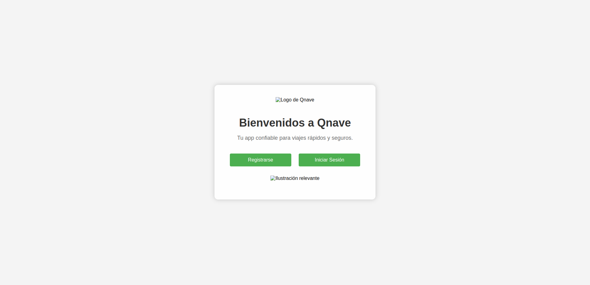

#### **1.2. Registro de Usuarios**
- **Descripción:** Formulario para que los usuarios se registren en la plataforma con datos personales y métodos de pago.
- **Imagen:** 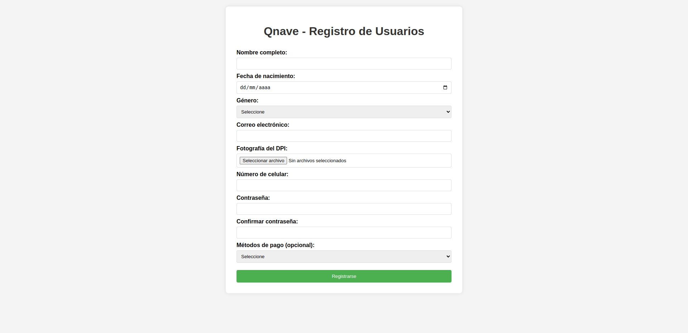

#### **1.3. Registro de Conductores**
- **Descripción:** Formulario para el registro de conductores, incluyendo datos personales y del vehículo.
- **Imagen:** 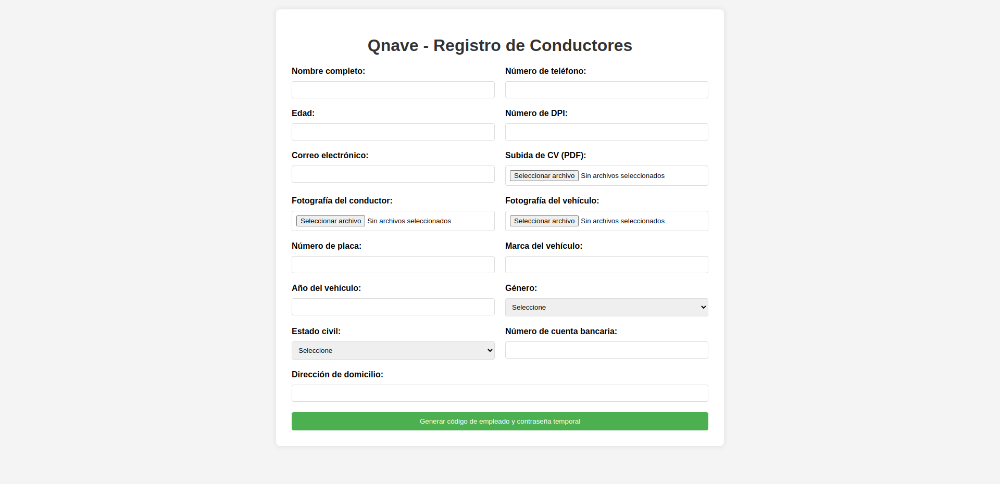

#### **1.4. Registro de Asistentes**
- **Descripción:** Formulario de registro para asistentes, similar al de conductores pero sin datos del vehículo.
- **Imagen:** 

#### **1.5. Pantalla de Inicio de Sesión**
- **Descripción:** Formulario para que los usuarios inicien sesión en la plataforma con su correo y contraseña.
- **Imagen:** 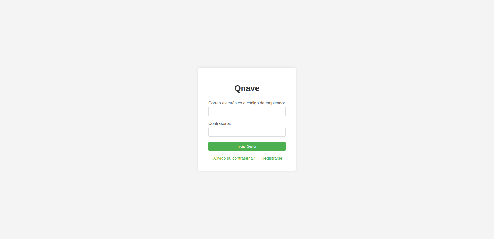

#### **1.6. Recuperación de Contraseña**
- **Descripción:** Formulario para que los usuarios puedan restablecer su contraseña si la han olvidado.
- **Imagen:** 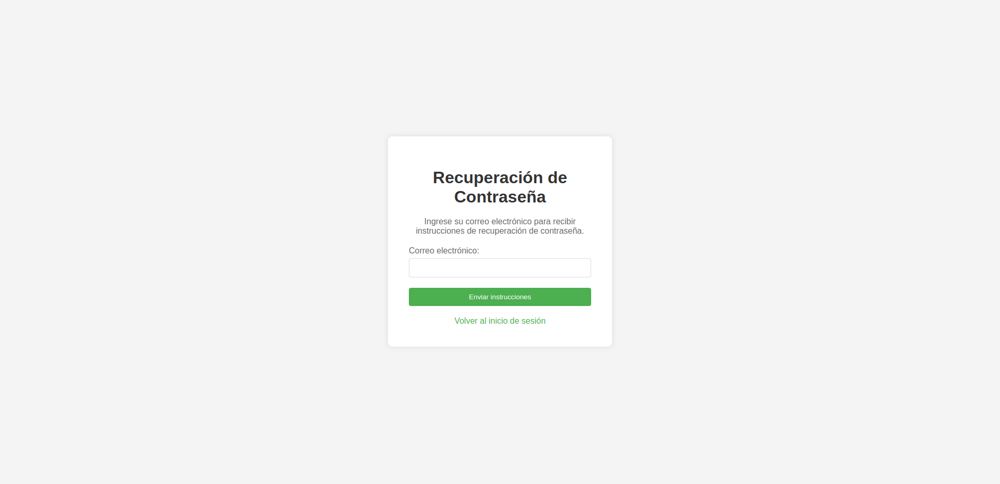

#### **1.7. Confirmación de Correo Electrónico**
- **Descripción:** Pantalla que solicita a los usuarios verificar su cuenta a través del correo electrónico.
- **Imagen:** 

#### **1.8. Pantalla de bloqueo de cuenta**
- **Descripción:** Vista que aparece cuando una cuenta es bloqueada por múltiples intentos fallidos de inicio de sesión.
- **Imagen:** 

### **2. Gestión de Viajes**

#### **2.1. Solicitud de Viaje**
- **Descripción:** Vista donde el usuario selecciona el punto de partida, destino y confirma la solicitud de viaje.
- **Imagen:** 

#### **2.2. Pantalla de Espera de Asignación**
- **Descripción:** Vista que muestra el proceso de búsqueda de un conductor disponible.
- **Imagen:** 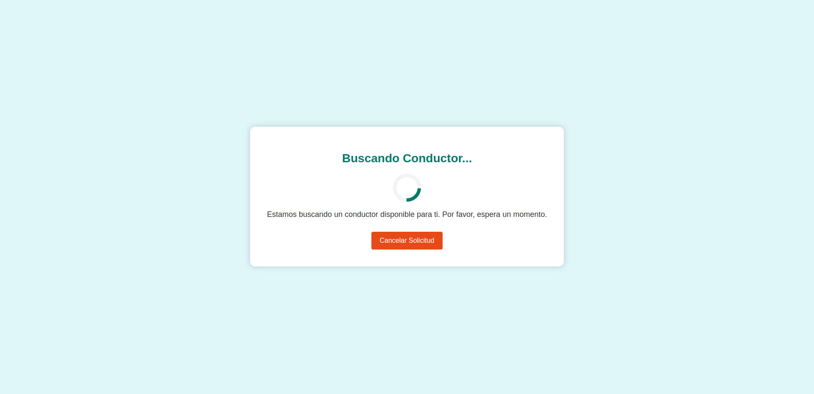

#### **2.3. Confirmación de Asignación**
- **Descripción:** Muestra la información del conductor asignado y su ubicación en tiempo real.
- **Imagen:** 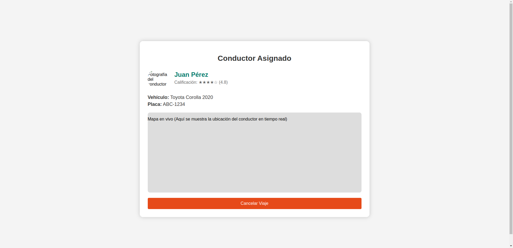

#### **2.4. Cancelación de Viaje**
- **Descripción:** Formulario para cancelar un viaje, incluyendo la selección de motivos.
- **Imagen:** 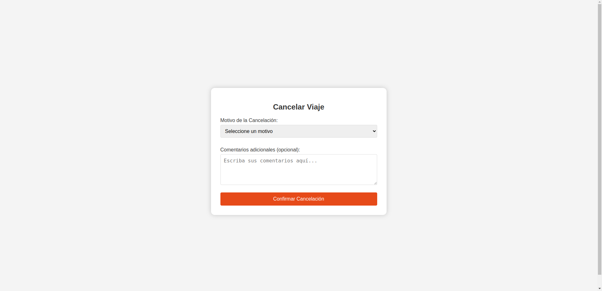

#### 2.5. Finalización de Viaje
- **Descripción:** Pantalla que aparece cuando el viaje ha finalizado, mostrando el costo y opciones de pago.
**Imagen:** 

### **3. Gestión de Información Personal**

#### **3.1. Perfil de Usuario**
- **Descripción:** Vista que muestra y permite editar la información personal del usuario, como nombre, correo y teléfono.
- **Imagen:** 

#### **3.2. Perfil de Conductor**
- **Descripción:** Vista con detalles adicionales del conductor, incluyendo información del vehículo.
- **Imagen:** 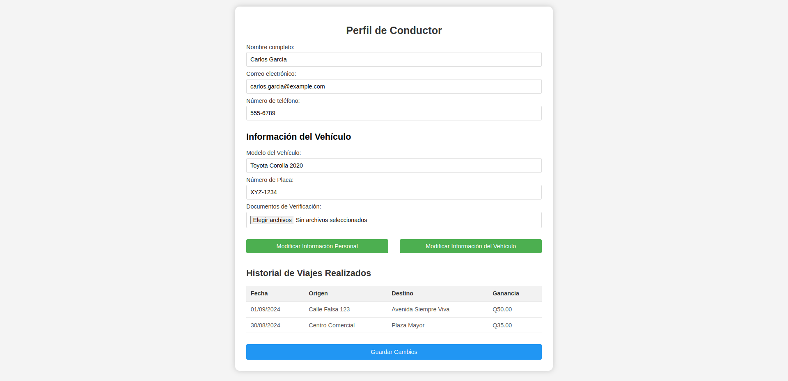

#### **3.3. Perfil de Asistente**
- **Descripción:** Vista similar al perfil de usuario, con detalles adicionales relevantes para el rol de asistente.
- **Imagen:** 

### **4. Gestión de Pagos**

#### **4.1. Gestión de Métodos de Pago**
- **Descripción:** Vista para administrar los métodos de pago registrados, como tarjetas de crédito o efectivo.
- **Imagen:** 

#### **4.2. Pantalla de Pago con Tarjeta**
- **Descripción:** Vista para seleccionar y confirmar el método de pago para un viaje o servicio.
- **Imagen:** 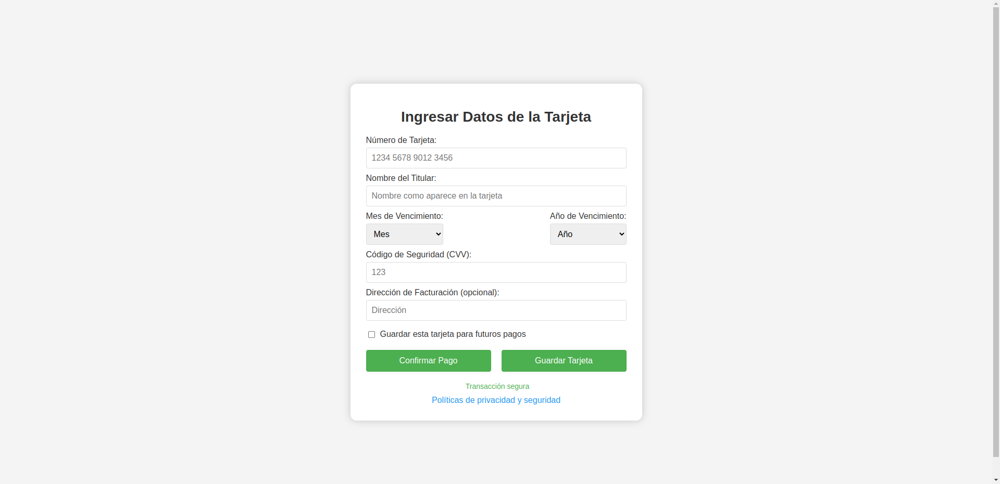

### **5. Interacción y Calificación**

#### **5.1. Pantalla de Calificación**
- **Descripción:** Interfaz para calificar un viaje o conductor y dejar comentarios adicionales.
- **Imagen:** 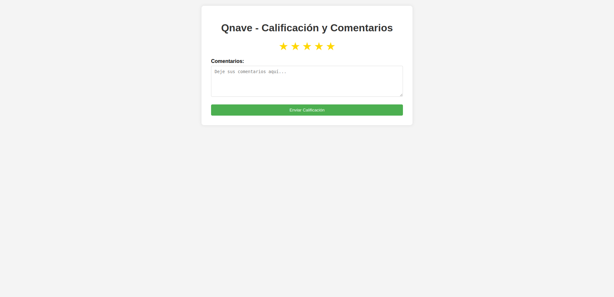

### **6. Reportes y Estadísticas (Administrador)**

#### **6.1. Dashboard del Administrador**
- **Descripción:** Vista principal para administradores con gráficos y estadísticas clave sobre la plataforma.
- **Imagen:** 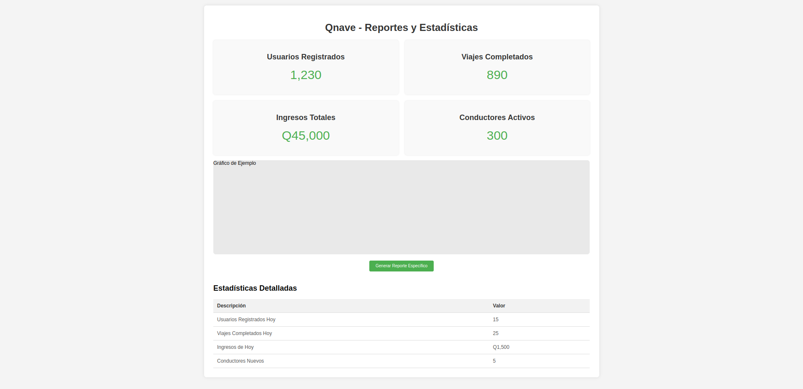

### **7. Administración (Solo para Administradores)**

#### **7.1. Gestión de Usuarios**
- **Descripción:** Vista para administrar usuarios, conductores y asistentes, con opciones para editar y eliminar cuentas.
- **Imagen:** 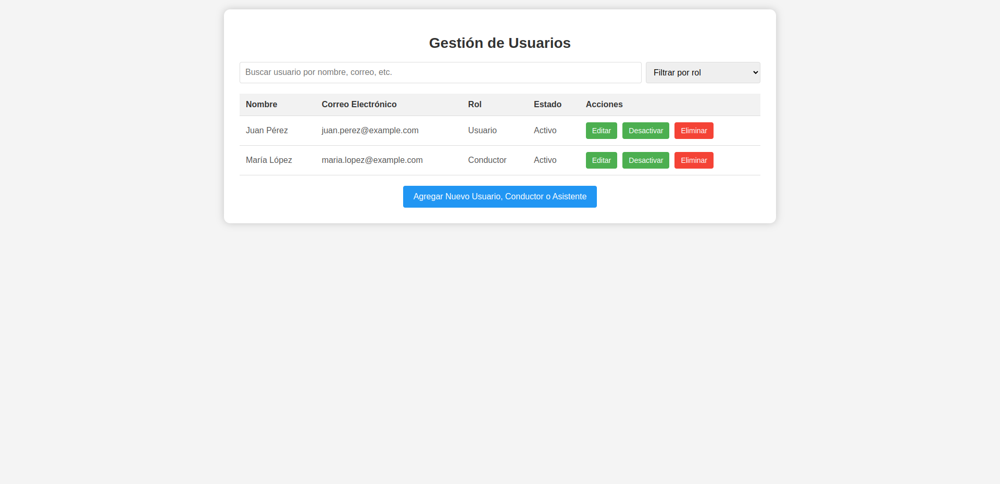

#### **7.2. Aprobación de Modificaciones Críticas**
- **Descripción:** Vista donde los administradores pueden aprobar o rechazar cambios críticos solicitados.
- **Imagen:** 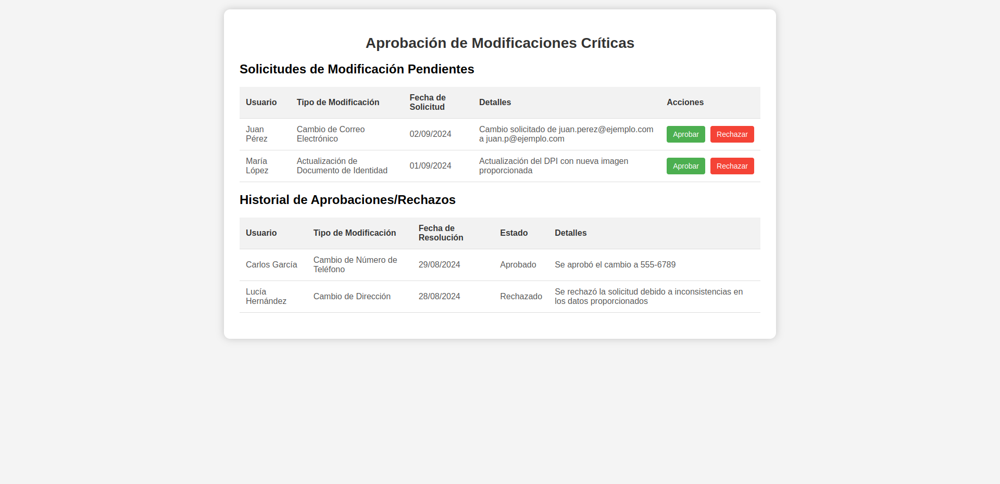

#### **7.3. Gestión de Bloqueos y Desbloqueos**
- **Descripción:** Vista para administrar cuentas bloqueadas, incluyendo opciones para desbloquearlas.
- **Imagen:** 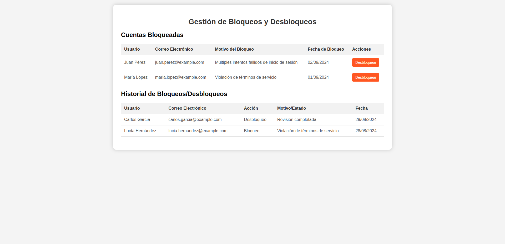

### **8. Cambio de Contraseña en el Primer Inicio de Sesión**

#### **8.1. Vista de Cambio de Contraseña Obligatorio**
- **Descripción:** Vista que solicita a los conductores y asistentes cambiar su contraseña temporal al iniciar sesión por primera vez.
- **Imagen:** 

### **9. Error de Confirmación de Cuenta**

#### **9.1. Vista de Error de Confirmación de Cuenta**
- **Descripción:** Vista que aparece cuando un usuario intenta iniciar sesión sin haber confirmado su cuenta.
- **Imagen:** 

### **10. Visualización de CVs de Conductores**

#### **10.1. Vista de CVs de Conductores**
- **Descripción:** Vista donde los administradores y asistentes pueden revisar los CVs de los conductores registrados.
- **Imagen:** 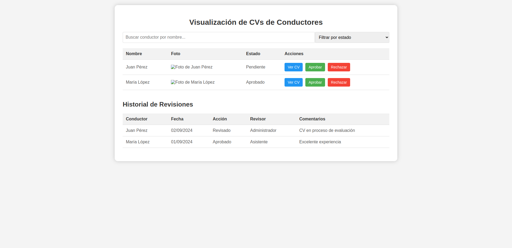

### **11. Ingreso de Clave .ayd para Administradores**

#### **11.1. Vista de Ingreso de Clave .ayd**
- **Descripción:** Vista que solicita a los administradores ingresar una clave adicional para acceder a funciones avanzadas.
- **Imagen:** 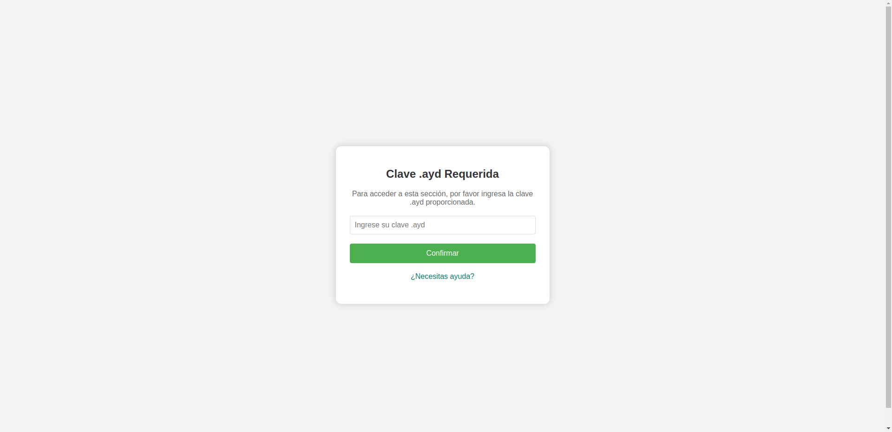

### **12. Contratación y Baja de Conductores por Asistentes**

#### **12.1. Vista de Contratación de Conductores**
- **Descripción:** Vista utilizada por los asistentes para contratar nuevos conductores, incluyendo la carga de documentos.
- **Imagen:** 

#### **12.2. Vista de Baja de Conductores**
- **Descripción:** Vista utilizada por los asistentes para dar de baja a conductores, incluyendo la selección de motivos.
- **Imagen:** 

### **13. Contratación y Baja de Asistentes por Administradores**

#### **13.1. Vista de Contratación de Asistentes**
- **Descripción:** Vista utilizada por los administradores para contratar nuevos asistentes, similar al registro de conductores.
- **Imagen:** 

#### **13.2. Vista de Baja de Asistentes**
- **Descripción:** Vista utilizada por los administradores para dar de baja a asistentes, similar a la baja de conductores.
- **Imagen:** 

## 11. Patrones de diseño
### Patrón Singleton

 
Este patrón es utilizado para garantizar una sola instancia de la base de datos.

### Patrón Proxy
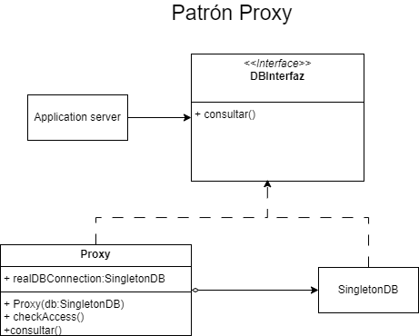
 
Utilizado para proteger la instancia de la base de datos, logrando que el servidor de aplicaciones se conecte al proxy, el cual, a su vez, se conecta  a la instancia real de la base de datos, permitiendo pre-procesar las consultas antes de ejecutarlas.

### Patrón Observer
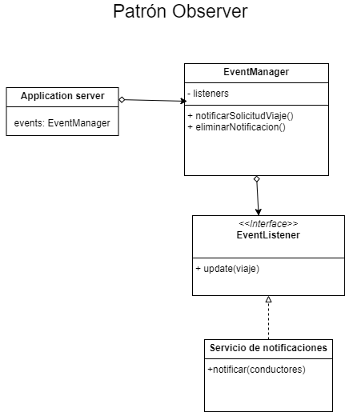
 
Este patrón es utilizado para enviar notificaciones a los conductores cuando un usuario a solicitado un viaje, permitiéndoles aceptar o rechazar el viaje. El patrón observer permite a los conductores estar siempre suscritos a las solicitudes de viajes.

### Patrón Command
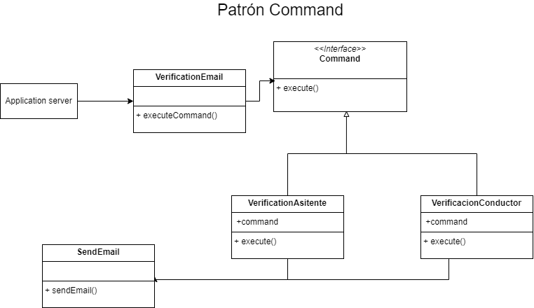
 
Permite enmascarar el envío de correos de verificación, para poder personalizar el mensaje según el tipo de registro (asitente o conductor) y luego acceder al servicio de envíos de correo electrónico.

## 12. Tablero Kanban
[Tablero Kanban](https://luisamaria.atlassian.net/jira/software/projects/AYD2P/boards/3?atlOrigin=eyJpIjoiNjk2NzhmZTkyYzRkNDhjNmI2MTY2ZTBhODAxODM2MGMiLCJwIjoiaiJ9) 

